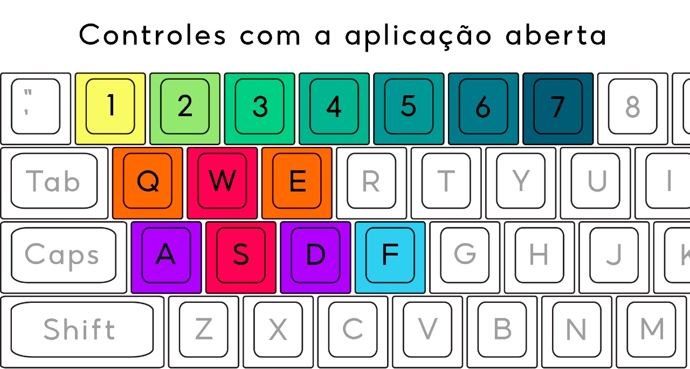
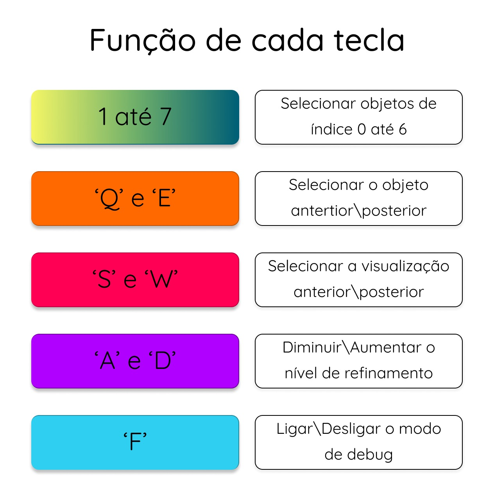

# Relatório: Problema 3 - Visualização de Objetos Implícitos

## Resolução do problema

## Algoritmos

### Escolha dos algoritmos

### Análise da complexidade

## Utilizando o programa

### Inicialização
O programa deve ser inicializado pelo terminal, chamando a função main e passando 3 parâmetros iniciais:
1. o objeto a ser visualizado (número de 0 a 7)
2. o tipo de visualização desejada (número de 0 a 2)
3. a precisão ou refinamento inicial (número de 0 a 10)

Caso algum parâmetro não seja passado ou não esteja dentro do limite estabelecido, o programa exibirá mensagens de texto para que o usuário digite novamente.

De acordo com as especificações do trabalho, todos esses parâmetros podem ser atualizados durante a visualização, não sendo necessário terminar o programa e chamá-lo novamente. Para entender como esses parâmetros são manipulados com a aplicação aberta, veja o próximo tópico, "Controles".

### Controles
As teclas que podem ser utilizadas são as seguintes:

Essas teclas foram escolhidas para fornecer a interatividade o mais intuitiva e facilitada possível. A seguir, veja a função de cada uma:

### Funções utilizadas
Foram escolhidas 7 funções para compor o trabalho, das quais quatro foram disponibilizadas pelo professor como exemplo e três foram escolhidas pela dupla. Segue o nome, a visualização 0 (apenas a linha da função) e a equação de cada função:

|1 - laço|2 - rotatória|3 - cardióide|4 - losango|5 - ventilador|6 - gaspar|7 - chinchila|
| :---: | :---: | :---: | :---: | :---: | :---: | :---: |
|imagem|imagem|imagem|imagem|imagem|imagem|imagem|
|x⁷ - y⁵ + x²y³ - (xy)²|x² + y² + xy - (xy)² * 0.5 - 0.25|(x² + y² - 4)³ - x² * y³|abs(x) + abs(y) - 2|x² - y² + y³ - x³ + (xy)² + (xy)³|x⁶ - y⁵ + x⁴ + y³ - x²|((x²/(y² + 2⁻¹⁰))senx)+ y² - x²seny - 1|